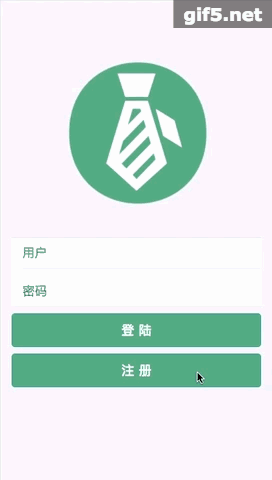

# 找实习 — 基于React16全家桶的实时聊天单页应用

## 概述

使用React16制作的的WebApp，UI方面，使用了React的UI库Ant Design Mobile，项目中涉及到一些高阶函数、高阶组件的部分，都做了详细的注解，并有demo。

## 功能

* 用户注册——实现了基本的注册功能，用户名的查重、两次密码一致、默认角色等。

* 用户登陆——实现了基本的登陆功能，用户名校验、密码校验、写入cookie等。

* 信息完善——针对不同的角色，进入不同的信息完善页，以及头像选择。

* 信息查看——列表形式展现信息。如果是实习生，可以看到BOSS的招聘信息；如果是招聘者，可以看到实习生寻求实习的信息。

* 发起聊天——点击对应的角色，可以发起对该角色的聊天。

* 实时聊天——可实时接收当前角色收到的信息。

* 消息列表显示——展示当前角色对不同角色的聊天列表。

* 未读消息数量——显示当前角色的未读消息数量。

* 用户退出——清除cookie，跳转回登陆页。

## 功能演示

**用户注册**

